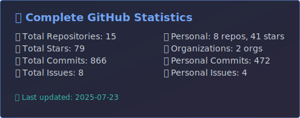
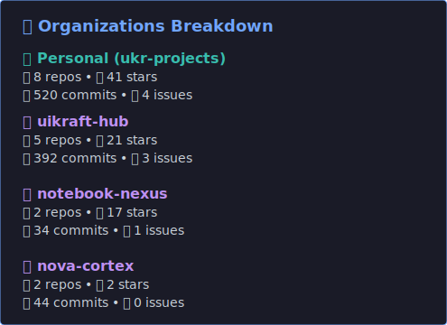

<!-- GitHub Stats - Auto Generated -->

# 🚀 Complete GitHub Analytics

## 📊 Quick Overview

| Metric | Personal | Organizations (Unique) | **Total** |
|--------|----------|------------------------|-----------|
| 📚 Repositories | 8 | 3 | **11** |
| ⭐ Stars | 41 | 0 | **41** |
| 💻 Commits | 512 | 116 | **628** |
| 🐛 Issues | 4 | 2 | **6** |

*Note: Organization stats exclude repositories already counted in personal stats to avoid double counting.*

*Last updated: 2025-07-23*

<!-- End GitHub Stats -->
