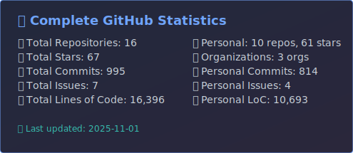
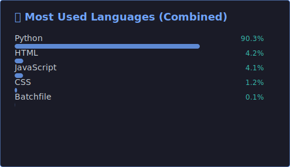

# 😎 Hi

  

---

## 🚀 About Me

- 🔭 Currently working on **AI/ML projects and full-stack applications**
- 🌱 Learning **Advanced Machine Learning & Cloud Architecture**
- 👯 Looking to collaborate on **Open Source Projects**
- 💬 Ask me about **Python, JavaScript, AI, and Software Development**
- 📫 Reach me at: **ujjwalkrai@gmail.com**
- ⚡ Fun fact: **I love solving complex problems with elegant code**

 

---

## 🛠️ Tech Stack

### Programming Languages

  
  
  
  
  
  
  
  
  
  
  
  
  
  
  

### Frameworks & Libraries

  
  
  
  
  
  
  
  
  
  
  
  
  

### Tools & Platforms

  
  
  
  
  
  
  
  
  
  

---

## 📊 GitHub Analytics

  
  

---

## 🎯 Current Focus

  <table>
    <tr>
      <td width="50%" align="center">
        <h3>🤖 AI & Machine Learning</h3>
        
Building intelligent systems with deep learning frameworks

        
      </td>
      <td width="50%" align="center">
        <h3>☁️ Cloud Architecture</h3>
        
Designing scalable cloud-native applications

        
      </td>
    </tr>
    <tr>
      <td width="50%" align="center">
        <h3>🌐 Full Stack Development</h3>
        
Creating end-to-end web applications

        
      </td>
      <td width="50%" align="center">
        <h3>🔐 DevSecOps</h3>
        
Implementing secure development practices

        
      </td>
    </tr>
  </table>

---

## 📈 Contribution Graph

  

---

## 🔗 Connect

#### 📝 Writing & Blogging

#### 💼 Professional

#### 🌐 Social

---

## 🌟 Top Languages

---

  <h3>Thanks for visiting! 😊</h3>
  
⭐ Don't forget to star my repositories if you find them useful!

